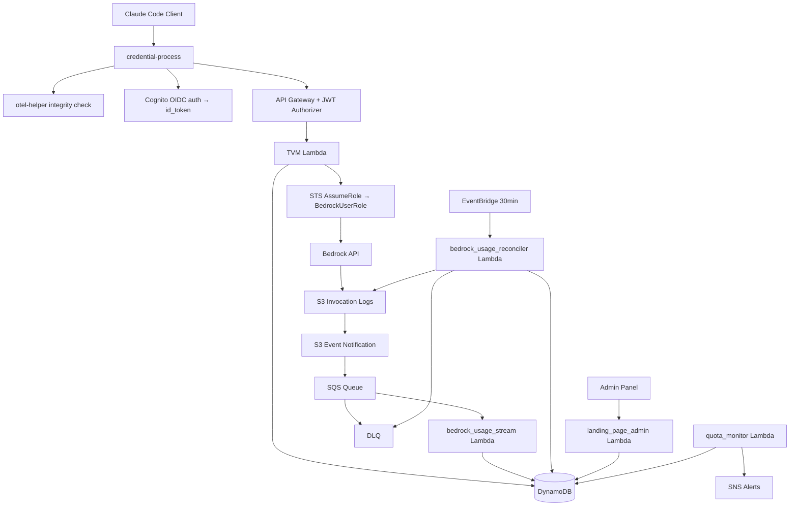
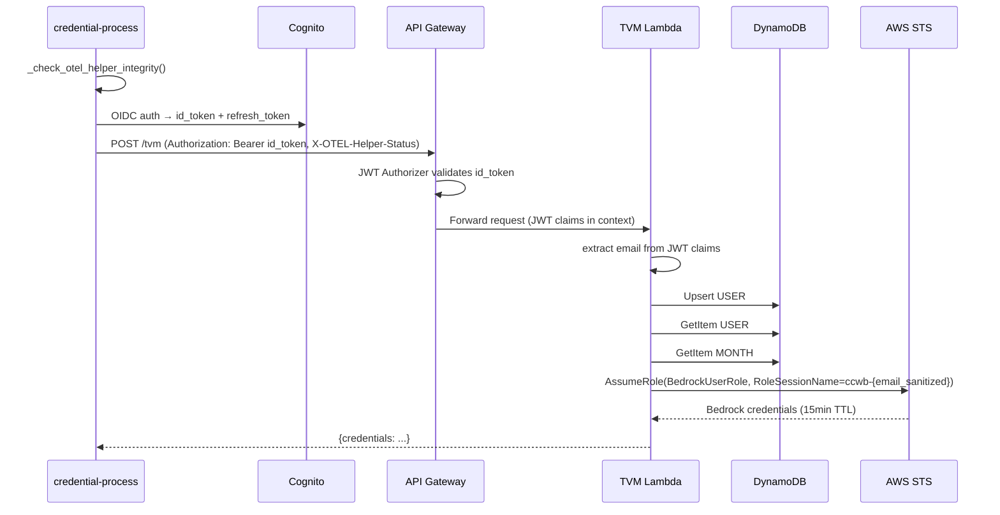
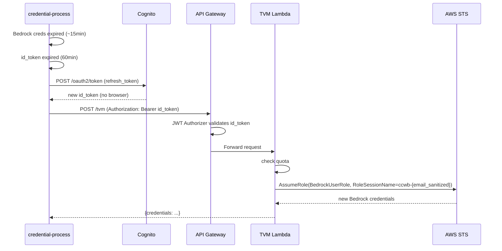
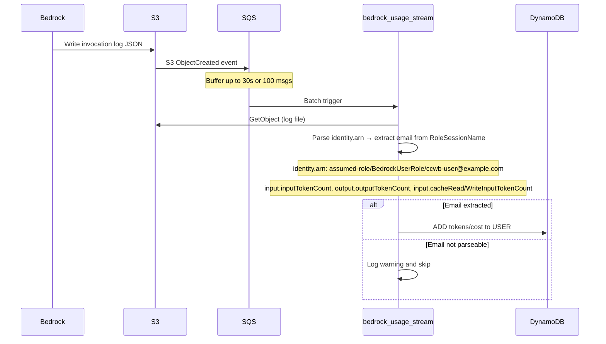

# Design Document: Cost Management Hardening

## Overview

The current quota/cost management system has several vulnerabilities: it relies entirely on the client-side OTEL pipeline for usage tracking (single point of failure), has no persistent user registry, and provides no mechanism to disable individual users. This design hardens the system across four phases: client-side hardening with refresh token support, server-side user registry via Token Vending Machine (TVM), Bedrock usage tracking with admin UI, and alerting/monitoring.

**Scope**: This design targets **Cognito User Pool** as the sole identity provider. Other IdP integrations (Okta, Azure AD, etc.) are out of scope for this iteration.

The core principle is that **no single client-side component should be able to disable quota enforcement**. The TVM pattern ensures all Bedrock credential issuance flows through a server-side Lambda that validates identity, checks quota, and issues short-lived credentials via STS AssumeRole. **Bedrock Model Invocation Logging (S3) is the single source of truth for usage tracking** — it is AWS-managed, tamper-proof, and independent of any client-side component. All consumers (TVM, quota_monitor, landing_page_admin, CLI commands) read from Bedrock records (`MONTH#YYYY-MM#BEDROCK`, `DAY#YYYY-MM-DD#BEDROCK`). The OTEL pipeline (`metrics_aggregator` → `MONTH#YYYY-MM`) still writes records but has no active readers.

## Architecture



## Sequence Diagrams

### Credential Acquisition Flow (No Cached Credentials)



### Silent Credential Refresh Flow



### Bedrock Usage Tracking Flow



## Components and Interfaces

### credential-process (Enhanced)

**Purpose**: Client-side credential provider with hardened security checks. Calls TVM Lambda for Bedrock credential issuance.

**Interface** (new/modified methods):
```python
def _check_otel_helper_integrity(self) -> str:
    """Verify otel-helper SHA256 hash. Returns status string: 'valid', 'missing', 'hash-mismatch', 'not-configured'."""

def _try_refresh_token(self) -> Optional[str]:
    """Exchange refresh_token for new id_token via Cognito /oauth2/token."""

def _try_silent_refresh(self) -> Tuple[Optional[dict], Optional[str], Optional[dict]]:
    """Try cached id_token first, then refresh_token. Returns (credentials, id_token, token_claims).
    Refactored from existing method — adds refresh_token fallback when id_token is expired."""

def _call_tvm(self, id_token: str, otel_helper_status: str) -> dict:
    """POST to tvm_endpoint (API Gateway /tvm route) with Authorization: Bearer {id_token}
    and X-OTEL-Helper-Status header. No AWS credentials needed — API Gateway JWT Authorizer
    validates the id_token. Returns Bedrock credentials or raises TVMDeniedError/TVMUnreachableError."""
```

**Responsibilities**:
- Check otel-helper binary integrity and record status (does not exit — status is reported to server)
- Use refresh_token (12h) to silently renew id_token without browser popup
- Call TVM via API Gateway with `Authorization: Bearer {id_token}` and `X-OTEL-Helper-Status` header (simple HTTP POST, no SigV4 or bootstrap credentials needed)
- Receive Bedrock credentials from TVM Lambda response
- If TVM is unreachable, no Bedrock credentials are issued (naturally fail-closed)
- Clear cached credentials when both id_token and refresh_token are expired

### TVM Lambda (Token Vending Machine)

**Purpose**: Server-side credential issuance with integrated user profile management, quota enforcement, and STS AssumeRole. Replaces the old quota_check + client-side GetCredentialsForIdentity flow.

**Key design**: The TVM Lambda is the sole path to Bedrock credentials. It is exposed as a `/tvm` route on the existing HTTP API Gateway, reusing the same JWT Authorizer already configured for the quota_check endpoint. The API Gateway validates the id_token (JWT) before invoking the Lambda — invalid tokens are rejected without triggering Lambda invocations. The Cognito Identity Pool / Direct STS auth role has Bedrock permissions removed, so clients cannot obtain Bedrock credentials without going through TVM. This approach requires only one STS call (the TVM's own AssumeRole), no bootstrap credentials, and no SigV4 signing on the client side.

**Interface**:
```python
def handle_tvm_request(event: dict) -> dict:
    """Validate JWT, upsert profile, check quota, assume role, return Bedrock credentials."""

def _upsert_profile(email: str, claims: dict, groups: list | None = None) -> None:
    """Create/update USER#{email} PROFILE record. Persists groups from JWT claims."""

def get_user_usage(email: str) -> dict:
    """Read MONTH# and DAY# Bedrock usage records (two point reads, no rollover logic)."""

def _compute_session_duration(usage: dict, policy: dict) -> Tuple[int, int]:
    """Compute STS DurationSeconds and effective session duration based on quota proximity.
    Returns (sts_duration, effective_seconds).
    STS minimum is 900s; effective duration can be shorter via session policy aws:EpochTime condition."""

def _assume_role_for_user(email: str, effective_seconds: int) -> dict:
    """Call sts:AssumeRole with RoleSessionName=ccwb-{email_sanitized}.
    Attaches a session policy with aws:EpochTime condition to limit Bedrock access
    to effective_seconds, even though STS credential TTL is 900s (minimum).
    Returns credentials dict with Expiration set to effective_seconds from now."""
```

**Responsibilities**:
- Extract email from API Gateway JWT Authorizer claims (JWT already validated by gateway; Cognito `email` claim hardcoded — other IdPs out of scope)
- On every request: upsert `USER#{email} SK=PROFILE` record (no IDENTITY# records needed — email is extracted from JWT)
- Check `profile.status` before quota resolution (disabled -> deny immediately)
- Read usage from `MONTH#YYYY-MM#BEDROCK` record (single source — Bedrock invocation logs)
- Compute effective session duration based on quota proximity (see Adaptive Session Duration below)
- Parse and log `X-OTEL-Helper-Status` header; optionally enforce via `REQUIRE_OTEL_HELPER` env var
- Call `sts:AssumeRole` with session policy containing `aws:EpochTime` condition to enforce effective duration server-side
- Override `Expiration` in returned credentials to `now + effective_seconds` so the SDK re-invokes credential-process at the right time
- Return credentials to the caller

### bedrock_usage_stream Lambda (New)

**Purpose**: Near-real-time Bedrock usage tracking via S3 events.

**Interface**:
```python
def handler(event: dict, context) -> dict:
    """Process SQS batch of S3 ObjectCreated events."""

def process_invocation_log(s3_key: str, bucket: str) -> None:
    """Parse Bedrock invocation log, update DynamoDB usage record."""

def extract_email_from_arn(identity_arn: str) -> Optional[str]:
    """Extract email from RoleSessionName in identity.arn field
    (e.g., 'arn:aws:sts::...:assumed-role/BedrockUserRole/ccwb-user@example.com' → 'user@example.com')."""
```

**Responsibilities**:
- Consume SQS messages (batches of up to 100, max 60s window)
- Parse Bedrock invocation log JSON (see [Bedrock Invocation Log Schema](#bedrock-invocation-log-schema-reference) below): extract top-level `timestamp`, `modelId` (full ARN — extract short model ID via last path segment for pricing lookup), `identity.arn` (IAM principal), and nested token counts: `input.inputTokenCount`, `output.outputTokenCount`, `input.cacheReadInputTokenCount`, `input.cacheWriteInputTokenCount`
- Convert log `timestamp` (UTC) to UTC+8 — use the converted timestamp for both `MONTH#YYYY-MM` and `DAY#YYYY-MM-DD` partition keys (NOT Lambda wall clock, which would be wrong for delayed/DLQ/reconciler events)
- Extract email from RoleSessionName in the IAM principal ARN (strip `ccwb-` prefix: `ccwb-user@example.com` -> `user@example.com`)
- After reading and parsing each S3 object, write processed marker `PK=PROCESSED#{sha256(s3_key)[:16]}` with TTL=48h — written before email check so that non-TVM logs (IAM users, other roles) are also marked, preventing reconciler from re-reading them on every scan
- If email cannot be parsed from ARN (non-TVM invocation), log warning and skip — marker already written
- Atomically `ADD` tokens/cost to two independent records: `USER#{email} MONTH#YYYY-MM#BEDROCK` (monthly aggregate) and `USER#{email} DAY#YYYY-MM-DD#BEDROCK` (daily record). Both are unconditional ADD — no conditional expressions, no rollover logic, safe under any event ordering or concurrency
- Return `ReportBatchItemFailures` for partial batch failures

### bedrock_usage_reconciler Lambda (New)

**Purpose**: Periodic fallback to catch missed events and process DLQ.

**Interface**:
```python
def handler(event: dict, context) -> None:
    """EventBridge-triggered reconciliation run."""

def reconcile_s3_window(minutes: int = 35) -> None:
    """List S3 objects in last N minutes, process unprocessed ones."""

def process_dlq(max_messages: int = 100) -> None:
    """Drain DLQ and reprocess failed messages."""
```

**Responsibilities**:
- List S3 objects in last 35-minute window (covers 30min schedule + buffer)
- Batch-check `PROCESSED#{sha256(s3_key)[:16]}` markers in DynamoDB (BatchGetItem, up to 100 keys per call) — skip objects with existing markers without reading S3
- Process remaining objects identically to stream Lambda, then write the same processed marker with TTL=48h
- Drain and reprocess DLQ messages
- Write heartbeat: `PK=SYSTEM#reconciler, last_run=<timestamp>`

### bedrock_logging_config Lambda (New)

**Purpose**: CloudFormation Custom Resource to ensure Bedrock Model Invocation Logging is enabled. Checks first — if already enabled, records the existing bucket and skips. If not enabled, creates an S3 bucket and enables logging.

**Interface**:
```python
def handler(event: dict, context) -> None:
    """CloudFormation Custom Resource handler (Create/Update/Delete)."""
```

**Responsibilities**:
- On Create/Update: call `bedrock.get_model_invocation_logging_configuration()`
- If logging already enabled: record existing S3 bucket name in response data, return success (no-op)
- If logging NOT enabled: create S3 bucket, call `bedrock.put_model_invocation_logging_configuration()`, return bucket name
- On Delete: return success (do NOT disable logging or delete bucket)

### landing_page_admin Lambda (Enhanced)

**Purpose**: Admin panel with complete user management and pricing configuration.

**New/modified handlers**:
```python
def api_list_users(event: dict) -> dict:
    """List users from PROFILE records (not MONTH# records). Supports status filter."""

def api_disable_user(event: dict) -> dict:
    """Set USER#{email} PROFILE.status = 'disabled'. TVM Lambda will deny all subsequent credential requests for this user."""

def api_enable_user(event: dict) -> dict:
    """Set USER#{email} PROFILE.status = 'active'."""

def api_list_pricing(event: dict) -> dict:
    """List pricing records from BedrockPricing table (key: model_id)."""

def api_update_pricing(event: dict) -> dict:
    """Update pricing record by model_id in BedrockPricing table."""
```

### package Command (Enhanced)

**Purpose**: Build and package the client distribution, including otel-helper hash computation.

**Modified behavior**:
- After building otel-helper binary, compute SHA256 hash
- Write `otel_helper_hash` field to `config.json`

## Data Models

### DynamoDB Records

```
User Profile:
PK=USER#{email}, SK=PROFILE
{
    first_activated: ISO8601 timestamp,  # if_not_exists — never overwritten
    last_seen: ISO8601 timestamp,        # updated each TVM request
    status: "active" | "disabled",
    sub: str,
    groups: list[str]                    # persisted from JWT claims on every TVM request
}

Bedrock Monthly Usage (new):
PK=USER#{email}, SK=MONTH#YYYY-MM#BEDROCK
{
    input_tokens: int,          # from log.input.inputTokenCount
    output_tokens: int,         # from log.output.outputTokenCount
    cache_read_tokens: int,     # from log.input.cacheReadInputTokenCount
    cache_write_tokens: int,    # from log.input.cacheWriteInputTokenCount
    total_tokens: int,          # inputTokenCount + outputTokenCount + cacheReadInputTokenCount + cacheWriteInputTokenCount
    estimated_cost: Decimal,
    last_updated: ISO8601 timestamp
}

Bedrock Daily Usage (new):
PK=USER#{email}, SK=DAY#YYYY-MM-DD#BEDROCK
{
    input_tokens: int,
    output_tokens: int,
    cache_read_tokens: int,
    cache_write_tokens: int,
    total_tokens: int,
    estimated_cost: Decimal,
    last_updated: ISO8601 timestamp
}
Note: One record per user per day (UTC+8 boundary). Independent of the monthly
record — no rollover logic needed. Eliminates concurrency/ordering issues.
TVM reads DAY#{today} for daily quota checks; admin panel can query DAY# range
for per-day usage history.

Pricing Config (existing BedrockPricing table):
PK=model_id  (HASH key, no prefix — e.g., "us.anthropic.claude-3-7-sonnet-20250805-v1:0" or "DEFAULT")
{
    input_per_1m: Decimal,
    output_per_1m: Decimal,
    cache_read_per_1m: Decimal,
    cache_write_per_1m: Decimal,
    updated_at: ISO8601 timestamp
}

Org Aggregate (new — maintained atomically by stream Lambda):
PK=ORG#global, SK=MONTH#YYYY-MM#BEDROCK
{
    total_tokens: int,          # SUM of all users' Bedrock total_tokens (via ADD)
    estimated_cost: Decimal,    # SUM of all users' Bedrock estimated_cost (via ADD)
    last_updated: ISO8601 timestamp
}

Processed Marker (new — written by stream Lambda and reconciler):
PK=PROCESSED#{sha256(s3_key)[:16]}, SK=MARKER
{
    s3_key: str,                # original S3 key for debugging
    processed_at: ISO8601 timestamp,
    ttl: int                    # epoch + 172800 (48h), DynamoDB TTL auto-deletes
}

Reconciler Heartbeat:
PK=SYSTEM#reconciler  (no SK)
{
    last_run: ISO8601 timestamp,
    records_processed: int
}
```

### config.json (Client)

```json
{
    "profile_name": {
        "provider_domain": "...",
        "client_id": "...",
        "identity_pool_id": "...",
        "otel_helper_hash": "<sha256-hex>",
        "tvm_endpoint": "https://...",
        "tvm_request_timeout": 5
    }
}
```

Note: Every credential-process invocation calls the TVM Lambda. There is no `quota_check_interval` — the TVM Lambda IS the credential issuance path, so quota is checked on every invocation. The `tvm_endpoint` replaces the old `quota_api_endpoint`.

## Key Functions with Formal Specifications

### _check_otel_helper_integrity()

**Preconditions:**
- `config` is loaded and accessible
- `otel_helper_hash` may or may not be present in config

**Postconditions:**
- If `otel_helper_hash` not in config: returns `"not-configured"`, prints warning to stderr
- If helper binary missing: returns `"missing"`, prints warning to stderr
- If hash mismatch: returns `"hash-mismatch"`, prints warning to stderr
- If hash matches: returns `"valid"`
- Does NOT exit or block execution — status is sent to TVM Lambda via `X-OTEL-Helper-Status` header for server-side enforcement

### get_user_usage() — Bedrock single source

**Preconditions:**
- `email` is a non-empty string
- DynamoDB table is accessible
- Month prefix is current YYYY-MM, day prefix is current YYYY-MM-DD (UTC+8)

**Postconditions:**
- Returns dict with fields: `total_tokens`, `daily_tokens`, `estimated_cost`, `daily_cost`, `input_tokens`, `output_tokens`, `cache_read_tokens`, `cache_write_tokens`
- Monthly values come from `MONTH#YYYY-MM#BEDROCK` record
- Daily values (`daily_tokens`, `daily_cost`) come from `DAY#YYYY-MM-DD#BEDROCK` record for today
- Missing records treated as zero for all fields
- Two point reads (monthly + daily), no conditional logic or rollover
- No side effects

**Loop Invariants:** N/A (single point read, no loops)

### _upsert_profile()

**Preconditions:**
- `email` is a non-empty string (extracted from validated JWT in TVM Lambda)
- DynamoDB table is accessible

**Postconditions:**
- `USER#{email} PROFILE` record exists
- `first_activated` is set only if it did not exist before (DynamoDB `if_not_exists`)
- `last_seen` is updated to current timestamp
- `status` defaults to `"active"` on first creation
- `groups` is overwritten on every call with the current JWT groups (or empty list)

### _compute_session_duration()

**Preconditions:**
- `usage` dict contains non-negative values for `estimated_cost`, `total_tokens`, `daily_cost`, `daily_tokens`
- `policy` dict contains non-negative limits (0 means unlimited for that dimension)

**Postconditions:**
- Returns `(sts_duration, effective_seconds)` where `sts_duration >= 900` (STS minimum)
- `effective_seconds` is monotonically decreasing as `max(quota_ratios)` increases
- If no quota limits are configured (all 0), `effective_seconds = TVM_SESSION_DURATION`
- `effective_seconds <= sts_duration` always holds

## Algorithmic Pseudocode

### TVM Flow

```pascal
PROCEDURE tvm_handle_request(request)
  INPUT: API Gateway event with JWT claims and X-OTEL-Helper-Status header
  OUTPUT: {credentials: dict} or {error: str}

  // JWT already validated by API Gateway JWT Authorizer
  claims ← event.requestContext.authorizer.jwt.claims
  email ← claims.get("email")  // Cognito email claim; other IdPs out of scope
  IF email IS NULL THEN RETURN error "email claim not found in token"

  helper_status ← request.headers["X-OTEL-Helper-Status"]
  log("otel_helper_status", helper_status)
  IF REQUIRE_OTEL_HELPER AND helper_status != "valid" THEN
    RETURN error "otel-helper required"

  _upsert_profile(email, claims, groups)

  profile ← dynamodb.get(PK="USER#" + email, SK="PROFILE")
  IF profile.status = "disabled" THEN
    RETURN error "user disabled"

  // Check org limits (single point read on ORG#global MONTH#YYYY-MM#BEDROCK)
  org_usage ← get_org_usage()  // reads ORG#global BEDROCK aggregate
  IF org_usage EXCEEDS org_limit THEN RETURN error "org quota exceeded"

  // Resolve quota policy and check usage
  policy ← resolve_policy(email)
  usage ← get_user_usage(email)  // single source: Bedrock invocation logs
  IF usage.estimated_cost >= policy.monthly_limit THEN
    RETURN error "user quota exceeded"

  // Compute effective session duration based on quota proximity
  (sts_duration, effective_seconds) ← _compute_session_duration(usage, policy)

  // Issue Bedrock credentials via AssumeRole with session policy
  email_sanitized ← sanitize_for_role_session(email)
  expiry_epoch ← current_epoch() + effective_seconds

  session_policy ← {
    "Version": "2012-10-17",
    "Statement": [{
      "Effect": "Allow",
      "Action": "bedrock:InvokeModel*",
      "Resource": "*",
      "Condition": {
        "NumericLessThan": {"aws:EpochTime": expiry_epoch}
      }
    }]
  }

  credentials ← sts.assume_role(
    RoleArn=BEDROCK_USER_ROLE_ARN,
    RoleSessionName="ccwb-" + email_sanitized,
    DurationSeconds=sts_duration,   // STS minimum 900s
    Policy=json.dumps(session_policy) // effective duration via EpochTime
  )

  // Override Expiration so SDK re-invokes credential-process at the right time
  credentials.Expiration ← iso8601(expiry_epoch)

  RETURN {credentials: credentials}
END PROCEDURE
```

### Adaptive Session Duration

```pascal
PROCEDURE _compute_session_duration(usage, policy)
  INPUT: usage dict (from get_user_usage), policy dict (resolved quota policy)
  OUTPUT: (sts_duration: int, effective_seconds: int)

  // Determine the most restrictive quota ratio across all dimensions
  ratios ← []
  IF policy.monthly_cost_limit > 0 THEN
    ratios.append(usage.estimated_cost / policy.monthly_cost_limit)
  IF policy.monthly_token_limit > 0 THEN
    ratios.append(usage.total_tokens / policy.monthly_token_limit)
  IF policy.daily_cost_limit > 0 THEN
    ratios.append(usage.daily_cost / policy.daily_cost_limit)
  IF policy.daily_token_limit > 0 THEN
    ratios.append(usage.daily_tokens / policy.daily_token_limit)

  quota_ratio ← max(ratios) IF ratios IS NOT EMPTY ELSE 0

  // Map quota proximity to effective session duration
  IF quota_ratio >= 0.95 THEN
    effective_seconds ← 60      // 1 min — almost at limit
  ELSE IF quota_ratio >= 0.90 THEN
    effective_seconds ← 120     // 2 min
  ELSE IF quota_ratio >= 0.80 THEN
    effective_seconds ← 300     // 5 min
  ELSE
    effective_seconds ← TVM_SESSION_DURATION  // default 900s (15 min)

  // STS AssumeRole minimum is 900s; session policy handles the real enforcement
  sts_duration ← max(900, effective_seconds)

  RETURN (sts_duration, effective_seconds)
END PROCEDURE
```

**Two-layer enforcement**:

| Layer | Mechanism | Effect |
|-------|-----------|--------|
| Server-side | Session policy `aws:EpochTime` condition | Bedrock returns `AccessDenied` after `effective_seconds`, even if client caches credentials |
| Client-side | `Expiration` in credential-process output | AWS SDK re-invokes credential-process at `effective_seconds`, triggering fresh TVM quota check |

### Bedrock Usage Stream Processing

```pascal
PROCEDURE process_sqs_batch(sqs_event)
  INPUT: SQS event with S3 ObjectCreated records
  OUTPUT: {batchItemFailures: list}

  failures ← []

  FOR each record IN sqs_event.Records DO
    TRY
      s3_key ← parse_s3_key(record)
      log_data ← s3.get_object(bucket, s3_key)
      invocation ← parse_invocation_log(log_data)

      // Bedrock invocation log schema (verified from actual S3/CloudWatch logs):
      //   timestamp: "2026-04-14T08:57:15Z"  (top-level, UTC)
      //   modelId: "arn:aws:bedrock:...:inference-profile/global.anthropic.claude-opus-4-6-v1"  (full ARN)
      //   identity.arn: "arn:aws:sts::...:assumed-role/BedrockUserRole/ccwb-user@example.com"
      //   input.inputTokenCount: int
      //   input.cacheReadInputTokenCount: int
      //   input.cacheWriteInputTokenCount: int
      //   output.outputTokenCount: int
      //   Note: large request/response bodies may be split to separate _input.json.gz / _output.json.gz S3 files
      //         via input.inputBodyS3Path / output.outputBodyS3Path — we only need the metadata fields above

      // Write processed marker BEFORE email check — ensures non-TVM logs
      // (IAM users, other roles) are also marked, so reconciler won't
      // re-read these S3 objects on every 30-min scan
      marker_key ← sha256(s3_key)[:16]
      dynamodb.put(
        PK="PROCESSED#" + marker_key,
        s3_key=s3_key,
        processed_at=now(),
        ttl=epoch_now() + 172800   // 48h
      )

      email ← extract_email_from_arn(invocation.identity.arn)
      // Parse RoleSessionName: assumed-role/BedrockUserRole/ccwb-user@example.com → user@example.com

      IF email IS NULL THEN
        log_warning("Could not extract email from ARN", invocation.identity.arn)
        CONTINUE   // marker already written — reconciler will skip this file
      END IF

      // Derive month and date from log timestamp (UTC → UTC+8), NOT from wall clock
      log_ts_utc8 ← convert_to_utc8(invocation.timestamp)
      log_month ← format(log_ts_utc8, "YYYY-MM")
      log_date ← format(log_ts_utc8, "YYYY-MM-DD")

      // Extract short model ID from ARN for pricing lookup
      // e.g., "arn:aws:bedrock:us-east-1:...:inference-profile/global.anthropic.claude-opus-4-6-v1"
      //     → "global.anthropic.claude-opus-4-6-v1"
      model_id ← extract_model_id_from_arn(invocation.modelId)

      // Token counts are nested under input/output objects
      input_tokens ← invocation.input.inputTokenCount
      output_tokens ← invocation.output.outputTokenCount
      cache_read_tokens ← invocation.input.cacheReadInputTokenCount OR 0
      cache_write_tokens ← invocation.input.cacheWriteInputTokenCount OR 0
      total_tokens ← input_tokens + output_tokens + cache_read_tokens + cache_write_tokens

      cost ← calculate_cost(model_id, input_tokens, output_tokens, cache_read_tokens, cache_write_tokens)
      month_sk ← "MONTH#" + log_month + "#BEDROCK"
      day_sk ← "DAY#" + log_date + "#BEDROCK"

      // Monthly aggregate — unconditional ADD (atomic, safe for concurrency)
      dynamodb.update(
        PK="USER#" + email, SK=month_sk,
        ADD total_tokens, input_tokens, output_tokens, cache_read_tokens, cache_write_tokens, estimated_cost
      )

      // Daily record — unconditional ADD to separate record per day
      // No rollover logic needed; each day is an independent record.
      // Event ordering does not matter — ADD is commutative.
      dynamodb.update(
        PK="USER#" + email, SK=day_sk,
        ADD total_tokens, input_tokens, output_tokens, cache_read_tokens, cache_write_tokens, estimated_cost
      )

      // Org aggregate (monthly totals only)
      dynamodb.update(
        PK="ORG#global", SK=month_sk,
        ADD total_tokens += total_tokens,
        ADD estimated_cost += cost
      )
    CATCH error
      failures.append(record.messageId)
    END TRY
  END FOR

  RETURN {batchItemFailures: failures}
END PROCEDURE
```

### Refresh Token Flow

```pascal
PROCEDURE _try_silent_refresh()
  OUTPUT: (credentials, id_token, token_claims) OR (null, null, null)

  SEQUENCE
    // Try cached id_token first (existing behavior)
    id_token ← get_cached_id_token()
    IF id_token IS NOT NULL AND NOT is_expired(id_token) THEN
      token_claims ← decode(id_token)
      credentials ← _call_tvm(id_token, self.otel_helper_status)
      save_credentials(credentials)
      RETURN (credentials, id_token, token_claims)
    END IF

    // NEW: Try refresh_token when id_token is expired
    refresh_token ← get_cached_refresh_token()
    IF refresh_token IS NULL THEN
      RETURN (null, null, null)  // Force browser login
    END IF

    response ← http_post(
      cognito_domain + "/oauth2/token",
      body={
        grant_type: "refresh_token",
        refresh_token: refresh_token,
        client_id: client_id
      }
    )

    IF response.status = 200 THEN
      id_token ← response.id_token
      token_claims ← decode(id_token)
      save_id_token(id_token, token_claims)
      credentials ← _call_tvm(id_token, self.otel_helper_status)
      save_credentials(credentials)
      RETURN (credentials, id_token, token_claims)
    ELSE
      clear_cached_refresh_token()
      RETURN (null, null, null)
    END IF
  END SEQUENCE
END PROCEDURE
```

## Example Usage

```python
# credential-process run() — enhanced flow with TVM
def run(self):
    # 1. Check otel-helper integrity (records status, does NOT exit)
    self.otel_helper_status = self._check_otel_helper_integrity()

    # 2. Try silent refresh first (returns tuple: credentials, id_token, token_claims)
    #    This internally calls TVM Lambda if a valid id_token is available
    silent_creds, id_token, token_claims = self._try_silent_refresh()
    if silent_creds:
        # TVM Lambda already validated quota and issued Bedrock credentials
        print(json.dumps(silent_creds))
        return 0

    # 3. No cached/refreshable credentials — browser auth
    if not id_token:
        id_token, token_claims = self.authenticate_oidc()  # browser login

    # 4. Call TVM via API Gateway (Bearer token auth, no SigV4 needed)
    #    API Gateway validates JWT, TVM upserts PROFILE, checks quota, assumes role
    try:
        credentials = self._call_tvm(id_token, self.otel_helper_status)
    except TVMDeniedError as e:
        print(f"ERROR: {e.reason}", file=sys.stderr)
        sys.exit(1)
    except TVMUnreachableError:
        print("ERROR: TVM Lambda unreachable", file=sys.stderr)
        sys.exit(1)

    # 6. TVM returned Bedrock credentials (different from bootstrap creds)
    save_credentials(credentials)
    print(json.dumps(credentials))
```

```python
# TVM Lambda — get_user_usage() reads two records (monthly + daily)
def get_user_usage(email: str) -> dict:
    now = datetime.now(EFFECTIVE_TZ)  # UTC+8
    month_item = get_item(f"USER#{email}", f"MONTH#{now:%Y-%m}#BEDROCK")
    day_item = get_item(f"USER#{email}", f"DAY#{now:%Y-%m-%d}#BEDROCK")
    return {
        "total_tokens": month_item.total_tokens,       # from MONTH#
        "estimated_cost": month_item.estimated_cost,    # from MONTH#
        "daily_tokens": day_item.total_tokens,          # from DAY#
        "daily_cost": day_item.estimated_cost,          # from DAY#
        ...
    }
```

## Bedrock Invocation Log Schema Reference

The following is the actual JSON schema of a Bedrock Model Invocation Log record, verified from the production S3/CloudWatch logs in this account (`data-us-east-1-022346938362` bucket, `bedrock-raw/` prefix). The stream Lambda and reconciler must parse this exact structure.

```json
{
  "schemaType": "ModelInvocationLog",
  "schemaVersion": "1.0",
  "timestamp": "2026-04-14T08:57:15Z",
  "accountId": "022346938362",
  "region": "us-east-1",
  "requestId": "081f659f-fc8a-40ce-8a6b-688bcaa9c628",
  "operation": "InvokeModelWithResponseStream",
  "modelId": "arn:aws:bedrock:us-east-1:022346938362:inference-profile/global.anthropic.claude-opus-4-6-v1",
  "input": {
    "inputContentType": "application/json",
    "inputBodyS3Path": "s3://.../_input.json.gz",
    "inputTokenCount": 1,
    "cacheReadInputTokenCount": 129709,
    "cacheWriteInputTokenCount": 411
  },
  "output": {
    "outputContentType": "application/json",
    "outputBodyJson": [ "... streaming chunks ..." ],
    "outputTokenCount": 326
  },
  "identity": {
    "arn": "arn:aws:iam::022346938362:user/endpoint-priv-ec2-cli"
  },
  "inferenceRegion": "ap-southeast-4"
}
```

**Key observations for stream Lambda implementation:**

| What we need | Field path | Notes |
|---|---|---|
| Timestamp | `timestamp` | Top-level, UTC ISO8601. Convert to UTC+8 for month/date partitioning. |
| Model ID | `modelId` | Full ARN, not short ID. Extract last path segment for pricing lookup: `arn:...:inference-profile/global.anthropic.claude-opus-4-6-v1` → `global.anthropic.claude-opus-4-6-v1` |
| Input tokens | `input.inputTokenCount` | Nested under `input` object. |
| Output tokens | `output.outputTokenCount` | Nested under `output` object. |
| Cache read tokens | `input.cacheReadInputTokenCount` | Nested under `input`. May be absent (treat as 0). |
| Cache write tokens | `input.cacheWriteInputTokenCount` | Nested under `input`. May be absent (treat as 0). |
| IAM principal | `identity.arn` | After TVM: `arn:aws:sts::...:assumed-role/BedrockUserRole/ccwb-user@example.com`. Currently IAM user ARN (pre-TVM). |
| Inference region | `inferenceRegion` | Actual region where inference ran (may differ from `region` due to cross-region inference). Informational only. |
| Operation | `operation` | `InvokeModel` or `InvokeModelWithResponseStream`. Both should be processed. |
| Large body split | `input.inputBodyS3Path` / `output.outputBodyS3Path` | When request/response body is large, it's stored in a separate `_input.json.gz` / `_output.json.gz` S3 file. The stream Lambda does NOT need to read these — all token counts are in the metadata record. |

**S3 key structure**: `bedrock-raw/AWSLogs/{accountId}/BedrockModelInvocationLogs/{region}/{YYYY}/{MM}/{DD}/{HH}/data/{requestId}_{input|output}.json.gz`

**Important**: The `_input.json.gz` and `_output.json.gz` files in S3 contain only the raw request/response bodies (for large payloads). The metadata record with token counts and identity is delivered to CloudWatch Logs. For S3-based processing, the stream Lambda should process CloudWatch Logs subscription or use the S3 invocation log files that contain the full metadata (when Bedrock writes the complete log record to S3 rather than splitting). The reconciler should query CloudWatch Logs as the authoritative source for metadata.

## Correctness Properties

- For all users u: if `PROFILE.status[u] = "disabled"`, then TVM Lambda returns error and no Bedrock credentials are issued
- For all users u: `get_user_usage(u)` reflects Bedrock invocation log data (single source of truth, AWS-managed, tamper-proof)
- For all credential-process invocations: `_check_otel_helper_integrity()` returns a status string and the status is sent to the TVM Lambda via `X-OTEL-Helper-Status` header
- For all credential-process invocations: if `REQUIRE_OTEL_HELPER` is enabled on the server and helper status is not `"valid"`, no credentials are issued (server-side enforcement)
- For all credential-process invocations: if TVM Lambda is unreachable, no Bedrock credentials are issued (naturally fail-closed)
- For all Bedrock invocations via TVM: the ARN contains the user's email in RoleSessionName, enabling direct attribution
- For all Bedrock invocations: usage is recorded in both MONTH# and DAY# DynamoDB records within 30 minutes (stream Lambda or reconciler)
- For all Bedrock invocations: daily usage records (DAY#) are independent per day — event ordering and concurrency cannot corrupt daily totals (all writes are unconditional ADD)
- For all successfully processed S3 objects: a `PROCESSED#{sha256(s3_key)[:16]}` marker exists in DynamoDB (TTL 48h), preventing duplicate processing by the reconciler
- For all TVM Lambda calls: `first_activated` is set only on the first call for a given email (idempotent); `groups` is overwritten on every call with current JWT groups
- For all TVM-issued credentials: if `usage/limit >= 0.95`, Bedrock access expires within 60 seconds (server-side via session policy `aws:EpochTime`, client-side via overridden `Expiration`)
- For all TVM-issued credentials: even if the client caches STS credentials beyond `Expiration`, the session policy denies Bedrock access after `effective_seconds`
- For all periodic credential refreshes: if both id_token and refresh_token are expired, cached credentials are cleared

## Error Handling

### otel-helper Missing or Tampered
- **Condition**: Binary not found or SHA256 mismatch
- **Response**: Record status (`"missing"` or `"hash-mismatch"`), print warning to stderr, continue execution. Status is sent to TVM Lambda via `X-OTEL-Helper-Status` header.
- **Server enforcement**: If `REQUIRE_OTEL_HELPER=true`, TVM Lambda denies credential issuance
- **Recovery**: User reinstalls the package

### TVM Lambda Unreachable
- **Condition**: HTTP timeout or error calling TVM Lambda
- **Response**: Deny credential issuance (naturally fail-closed — no TVM response means no Bedrock credentials)
- **Recovery**: Automatic on next invocation when TVM Lambda is reachable

### TVM Lambda Cold Start
- **Condition**: First TVM Lambda invocation or invocation after idle period
- **Response**: Higher latency for credential issuance (Lambda cold start + STS AssumeRole call)
- **Mitigation**: Lambda warm instances help reduce latency; provisioned concurrency can be configured if needed

### refresh_token Expired
- **Condition**: Both id_token and refresh_token are expired
- **Response**: Clear cached credentials, fall through to browser auth flow
- **Recovery**: User completes browser login (once per 12h)

### SQS Message Processing Failure
- **Condition**: Exception processing an S3 log file
- **Response**: Return message ID in `batchItemFailures` — only failed messages retry
- **Recovery**: SQS retries up to 3 times -> DLQ (14-day retention); reconciler reprocesses DLQ

### Email Not Parseable from ARN
- **Condition**: Bedrock invocation log has IAM principal ARN that does not match the expected `ccwb-` RoleSessionName pattern
- **Response**: Log warning and skip the record (non-TVM Bedrock calls are filtered out)
- **Recovery**: Stream Lambda filters IAM role ARN prefix to only process TVM-issued credentials

### User Disabled
- **Condition**: `PROFILE.status = "disabled"` at TVM request time
- **Response**: TVM Lambda returns error — no Bedrock credentials issued
- **Recovery**: Admin re-enables user via admin panel

## Testing Strategy

### Unit Testing Approach

- `_check_otel_helper_integrity()`: test missing binary (returns `"missing"`), hash mismatch (returns `"hash-mismatch"`), hash match (returns `"valid"`), no hash configured (returns `"not-configured"`)
- `get_user_usage()`: test Bedrock record present (returns values), missing (returns zeros)
- `_upsert_profile()`: test first call (first_activated set), subsequent call (first_activated unchanged, last_seen updated)
- `_try_silent_refresh()`: test valid cached id_token, expired id_token + valid refresh_token, both expired
- `_call_tvm()`: test successful credential return, denied response, unreachable endpoint
- `_compute_session_duration()`: test each tier (< 80% → 900s, 80-90% → 300s, 90-95% → 120s, >= 95% → 60s), no limits configured → default, multiple dimensions (picks highest ratio)
- `_assume_role_for_user()`: test correct RoleSessionName format (ccwb- prefix, sanitized email, max 64 chars), session policy contains correct `aws:EpochTime`, returned `Expiration` matches effective duration
- `extract_email_from_arn()`: test standard email, email with special characters, non-matching ARN pattern
- `process_sqs_batch()`: test email extracted from ARN, unparseable ARN (skipped), partial batch failure

### Property-Based Testing Approach

**Property Test Library**: pytest with hypothesis

- `get_user_usage()` returns non-negative values for any Bedrock usage record state (present, missing, partial fields)
- `_upsert_profile()` is idempotent: calling N times with same email produces same `first_activated`
- `process_sqs_batch()` writes `PROCESSED#` marker after successful processing; reconciler with same S3 key skips processing (no double-count)
- `_compute_session_duration()`: for any usage/policy combination, `effective_seconds` is monotonically decreasing as `max(ratios)` increases; `sts_duration >= 900` always holds
- `sanitize_for_role_session(email)` always produces output matching `[\w+=,.@-]` and length <= 59 chars (64 minus "ccwb-" prefix)

### Integration Testing Approach

- End-to-end: credential-process -> API Gateway -> TVM Lambda -> STS AssumeRole -> Bedrock credentials
- Bedrock log -> S3 -> SQS -> stream Lambda -> email extraction from ARN -> DynamoDB BEDROCK record + ORG aggregate
- Admin disable -> TVM Lambda denies next credential request
- Refresh token flow: expired id_token -> refresh -> new id_token -> TVM Lambda -> credentials

## Performance Considerations

- TVM Lambda adds latency to every credential issuance (DynamoDB reads + STS AssumeRole call); JWT validation is handled by API Gateway JWT Authorizer before Lambda invocation
- API Gateway adds minimal latency (~5-10ms) but provides built-in throttling, WAF integration, and request validation
- Lambda warm instances help reduce latency; provisioned concurrency can be configured for high-traffic deployments
- Stream Lambda batches up to 100 SQS messages per invocation with 30s window — reduces Lambda invocations significantly vs. per-file triggering
- DynamoDB `ADD` atomic updates are concurrency-safe — no locking needed for parallel stream Lambda invocations
- Reconciler scans only last 35-minute S3 window (not full bucket) — bounded execution time
- TVM Lambda caches org policy in memory for 60s — reduces DynamoDB reads
- `get_user_usage()` does 2 DynamoDB point reads (MONTH# + DAY#) — O(1) latency each, no conditional logic
- Org-level quota check does 1 point read on `ORG#global MONTH#YYYY-MM#BEDROCK` — maintained by stream Lambda, no user scan needed

## Security Considerations

- API Gateway JWT Authorizer validates Cognito id_token before TVM Lambda is invoked — unauthenticated requests are rejected at the gateway level, TVM Lambda only processes verified identities
- No bootstrap credentials needed — client sends `Authorization: Bearer {id_token}` directly to API Gateway; simplifies client code (no SigV4 signing, no Cognito Identity Pool in TVM flow)
- TVM Lambda is naturally fail-closed — if unreachable, no Bedrock credentials are issued (no `quota_fail_mode` configuration needed)
- otel-helper hash verification reports integrity status to server — server-side `REQUIRE_OTEL_HELPER` enforcement prevents tampered binaries from bypassing usage tracking
- refresh_token stored in OS keyring (Windows/macOS) or session file with restricted permissions (Linux)
- `PROFILE.status` check happens before quota policy resolution — disabled users cannot bypass via policy manipulation
- Bedrock invocation logging is account-level (AWS-managed) — cannot be disabled by end users
- Stream Lambda filters IAM role ARN prefix to ignore non-TVM Bedrock calls
- Adaptive session duration with two-layer enforcement: session policy `aws:EpochTime` enforces server-side credential expiry (client cannot bypass), overridden `Expiration` triggers SDK re-invocation (client cooperates); near-quota users get 60s sessions, reducing the window between exceeding quota and losing access
- `RoleSessionName` limits: max 64 chars, `[\w+=,.@-]` only — email is sanitized to fit these constraints

## Dependencies

- AWS Cognito User Pool (refresh_token support — requires `RefreshTokenValidity = 720 min` in `cognito-user-pool-setup.yaml` CLI App Client; note: `bedrock-auth-cognito-pool.yaml` only references existing pool IDs)
- AWS API Gateway HTTP API with JWT Authorizer (existing, reused from quota_check — `/tvm` route added)
- AWS STS (AssumeRole for Bedrock credential issuance via TVM Lambda)
- IAM BedrockUserRole (trusted by TVM Lambda execution role, grants Bedrock access)
- AWS Bedrock Model Invocation Logging -> S3 (must be enabled; existing deployments already have it)
- AWS SQS (standard queue with DLQ)
- AWS Lambda (TVM, bedrock_usage_stream, bedrock_usage_reconciler, bedrock_logging_config)
- AWS EventBridge Scheduler (reconciler every 30min)
- AWS CloudWatch Alarms + SNS (alerting)
- DynamoDB (existing table, new record types: PROFILE, BEDROCK usage, PRICING#, SYSTEM#)
- Python `keyring` library (refresh_token storage on Windows/macOS)
- Python `hashlib` (SHA256 for otel-helper integrity check)
